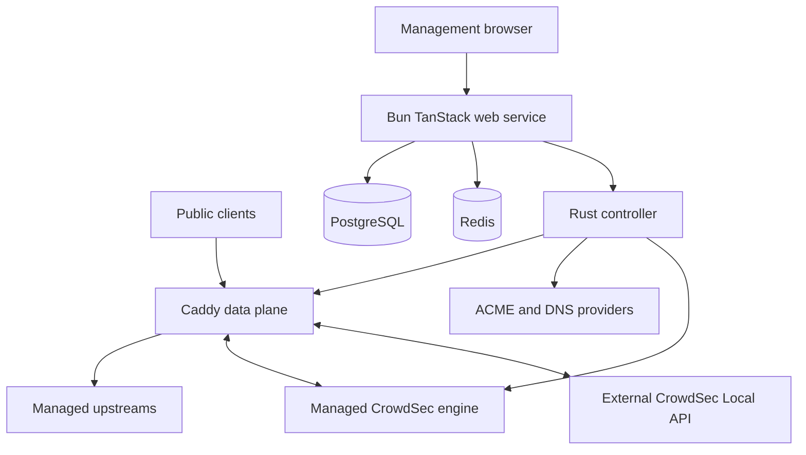

# RentnerProxy architecture

RentnerProxy is a public-alpha self-hosted reverse-proxy manager. The production
appliance is one Docker container with a Bun/TanStack management service, a Rust
controller, Caddy, PostgreSQL, and Redis. The deployment and support posture is
described in [`README.md`](./README.md), [`SECURITY.md`](./SECURITY.md), and
[`CONTRIBUTING.md`](./CONTRIBUTING.md). This document describes the implementation
in this repository; it is not a promise of a particular release or deployment.

## Runtime shape

The production image and its pinned base components are assembled in
[`docker/production/Dockerfile`](./docker/production/Dockerfile). The supervisor
in [`docker/production/entrypoint.sh`](./docker/production/entrypoint.sh) starts
PostgreSQL on loopback, an intentionally non-durable local Redis, the controller
on `127.0.0.1:8081`, and the Bun server on port `3000`. Caddy is started by the
controller and listens on the internal HTTP/TLS ports. The Compose mapping in
[`docker-compose.yml`](./docker-compose.yml) exposes managed traffic on host
ports 80 and 443 and binds the management UI to host loopback port 81.
The web service, controller, and PostgreSQL processes use separate Unix users and
private directories in the appliance image; the controller-to-Caddy admin and
runtime-probe sockets are also private filesystem endpoints. Caddy runs as a child of the
controller with the same Unix identity; they are not isolated security principals. Public proxy traffic
therefore reaches Caddy through the published data-plane ports, while management
traffic reaches Bun through the loopback-bound port.

### Management service

The web application is TanStack Start/React running under Bun. Server functions
implement authentication, authorization, users, roles, proxy-host and redirect
configuration, policies, certificates, audit history, and settings. The service
uses Drizzle over Bun SQL for PostgreSQL, as shown by
[`web/src/db/index.ts`](./web/src/db/index.ts) and the schema under
[`web/src/db/Schema/`](./web/src/db/Schema/). Migrations take a PostgreSQL
advisory lock and synchronize the authorization registry in
[`web/src/db/migrate.ts`](./web/src/db/migrate.ts).

Redis is a local connection used for rate limiting, authentication challenges,
and cross-process application-change notifications. The client and its reconnect
behavior are in [`web/src/server/redis/client.server.ts`](./web/src/server/redis/client.server.ts);
the realtime service publishes and subscribes to the `rentnerproxy:realtime` channel in
[`web/src/websockets/Server/realtimeRedis.service.ts`](./web/src/websockets/Server/realtimeRedis.service.ts).
Redis is not the source of truth and is deliberately run without persistence by
the production entrypoint.

The Bun server exposes HTTP and one authenticated, origin-checked native WebSocket
endpoint per browser tab. WebSocket subscriptions sample the same server-side
snapshots used by HTTP and enforce connection, payload, subscription, message-rate,
and backpressure limits. The transport is assembled in
[`docker/web/serve.mjs`](./docker/web/serve.mjs) and
[`web/src/websockets/Server/realtimeWebSocket.ts`](./web/src/websockets/Server/realtimeWebSocket.ts).

### Rust controller and Caddy

The Rust service is an Axum HTTP controller. Its internal routes are protected by
the controller bearer token when configured; a non-loopback controller refuses to
start without one. Route registration and authorization are in
[`controller/src/server/mod.rs`](./controller/src/server/mod.rs) and
[`controller/src/server/auth.rs`](./controller/src/server/auth.rs), and the
configuration checks are in [`controller/src/config.rs`](./controller/src/config.rs).

The controller validates the desired proxy model, renders Caddy JSON, starts or
loads Caddy through a Unix-domain admin socket, and probes a revision endpoint
before reporting success. [`controller/src/runtime/engine.rs`](./controller/src/runtime/engine.rs),
[`controller/src/runtime/configuration.rs`](./controller/src/runtime/configuration.rs),
and [`controller/src/runtime/apply.rs`](./controller/src/runtime/apply.rs) contain
that lifecycle. The rendered config enables Caddy's file storage. Separately, the
controller persists the desired proxy snapshot in schema version 7; certificates
are loaded from controller-owned paths. Caddy's automatic HTTPS is disabled, so the
controller owns ACME issuance and renewal rather than delegating it to Caddy. See
[`controller/src/runtime/renderer/config.rs`](./controller/src/runtime/renderer/config.rs).

The web service maintains a serialized reconciliation worker in
[`web/src/server/ProxyRuntime/proxy-reconcile.ts`](./web/src/server/ProxyRuntime/proxy-reconcile.ts).
It sends a database-derived snapshot to the controller, requires the returned
active revision to match, then checks the latest desired revision. A periodic drift
check queues another apply when the controller does not match the desired snapshot.

### CrowdSec control and enforcement

PostgreSQL stores the desired CrowdSec mode, managed community opt-in, and an encrypted external bouncer credential. The
credential is write-only at the browser boundary. A dedicated reconciliation worker in
[`web/src/server/Admin/CrowdSec/`](./web/src/server/Admin/CrowdSec/) restores that desired state
after controller or web-process restarts. The controller validates a target before replacing the
active provider, retains the prior provider on failure, and renders only a Caddy environment
placeholder for the secret.

Managed mode starts the pinned CrowdSec engine through
[`docker/crowdsec/runtime/supervisor.sh`](./docker/crowdsec/runtime/supervisor.sh). It runs as UID
10003, reads the shared Caddy access log through a dedicated group-readable, setgid log
directory, and stores its database and credentials under
`/var/lib/rentnerproxy/crowdsec`, exposes its Local API only at `127.0.0.1:18080`, and exposes
acquisition metrics only on loopback `127.0.0.1:6060`. Each new
managed activation rotates the internal bouncer key before Caddy starts using it; a supervised
engine restart during an active session keeps that key. External mode does not proxy or redirect
the configured endpoint. Both modes use the same Caddy HTTP
bouncer and Caddy's native effective client address. The ACME HTTP-01 route precedes the bouncer;
other public HTTP and HTTPS handlers follow it. The bouncer streams decisions with hard failures
disabled, so a Local API outage is reported as degraded while proxy traffic remains available.

Managed community participation is a supervisor submode, not another Caddy provider. The
supervisor registers the engine with the CrowdSec Central API only after an explicit opt-in,
persists its online credentials under the existing CrowdSec data directory, and switches the
engine from its offline configuration only when online credentials and Central API access are
verified. Failed registration leaves local protection active and is retried with a bounded
interval. Changing this preference does not restart Caddy. Console enrollment is another,
separate explicit action available only while the managed community connection is healthy. A
short-lived, permission-restricted request file hands the one-time key from the controller to
the root supervisor; the supervisor invokes `cscli`, removes the request, and publishes only a
redacted pending/failure result. No key is stored in PostgreSQL or returned in status responses.
The CLI-derived Console state distinguishes pending acceptance from enrollment.

### Forward Auth access policies

An Access Policy may hold a validated Forward Auth configuration alongside its existing IP rules. The web service stores the configuration in PostgreSQL, projects only runtime fields into the desired proxy snapshot, and the controller validates the same shape before rendering typed Caddy JSON. Provider selection is UI metadata; the Caddy path is provider independent. No authentication credential is stored for the gateway. See the [operator guide](./docs/forward-auth.md).

On a protected host, the effective order is ACME challenge, optional CrowdSec, HTTPS enforcement, the explicitly configured public auth-gateway path, IP rules when combined with `all`, Forward Auth or Basic Auth, body limit, then the application reverse proxy. Basic Auth and Forward Auth are mutually exclusive. `combined/any` remains available for Basic Auth and IP rules, but is rejected for Forward Auth so an IP match cannot bypass it. The gateway path is proxied only to the configured auth service and must be chosen narrowly by the administrator.

The auth precheck is a bounded GET using Caddy's reverse proxy response interception. It sends a rebuilt header set with the original host in `X-Forwarded-Host`, method, URI, effective client IP, trusted original scheme, and only selected Cookie or Authorization credentials. An HTTPS gateway uses its own DNS name for HTTP Host and TLS server name. Configured identity response headers are copied to the original request only on 2xx. The renderer strips incoming identity headers before checking and removes Authorization before the protected application. Other auth responses return to the client; transport errors cannot continue to the application. HTTPS gateway connections verify their certificate against system trust. The endpoint intentionally permits an administrator to name an internal HTTP service; protecting that network remains a deployment responsibility.

## Certificate and trust boundaries

PostgreSQL is the web application's durable record of certificate metadata,
domains, host bindings, jobs, cursors, event receipts, and audit rows. The Rust
controller is the authority for certificate private keys, full-chain files,
ACME-account state, material versions, candidates, activation, and renewal state
under its configured state directory. The separation is visible in
[`web/src/db/Schema/certificates.ts`](./web/src/db/Schema/certificates.ts),
[`web/src/db/Schema/certificateJobs.ts`](./web/src/db/Schema/certificateJobs.ts),
[`controller/src/runtime/certificates/material_files.rs`](./controller/src/runtime/certificates/material_files.rs),
and [`controller/src/runtime/certificates/activation.rs`](./controller/src/runtime/certificates/activation.rs).

For a host certificate request, the web service creates or reuses an idempotent
database job, records the host revision and required permissions, and lets a server
worker continue after the dialog or web process changes. Before binding, the worker
rechecks the host revision, domains, certificate ownership, and permissions. The
controller validates certificate coverage and only reports an applied proxy revision
after Caddy accepts and probes it. The job implementation is in
[`web/src/server/Admin/ProxyHostManagement/certificate-jobs.worker.server.ts`](./web/src/server/Admin/ProxyHostManagement/certificate-jobs.worker.server.ts)
and [`web/src/server/Admin/ProxyHostManagement/certificate-jobs.binding.server.ts`](./web/src/server/Admin/ProxyHostManagement/certificate-jobs.binding.server.ts).

The controller writes issued ACME material as a durable candidate before activation.
An activation failure leaves the previous valid material serving and schedules a
retry or marks the operation as needing attention. Startup recovery reconciles the
index and candidate manifests in [`controller/src/runtime/certificates/recovery.rs`](./controller/src/runtime/certificates/recovery.rs).
The web database therefore mirrors controller metadata; it does not replace the
controller's material or activation authority.

There are two independent forwarding-trust settings. Caddy trusts forwarded
protocol information only from configured socket-peer CIDRs, with strict single
value handling in the rendered routes. The management service's
`RENTNERPROXY_TRUST_PROXY_HEADERS` setting controls request-protocol handling for
the web application. The controller-side parsing is in
[`controller/src/config.rs`](./controller/src/config.rs) and
[`controller/src/runtime/renderer/routes.rs`](./controller/src/runtime/renderer/routes.rs);
the web-side setting is in [`web/src/server/env.server.ts`](./web/src/server/env.server.ts).
The settings are intentionally deployment configuration, not PostgreSQL state.

## Events and live state

Successful management mutations publish an application revision locally and to
Redis. WebSocket subscriptions then sample changed topics; Redis loss can delay or
drop notifications, but the next HTTP or live snapshot reads PostgreSQL/controller
state again. Startup and shutdown wiring is in [`web/src/start.ts`](./web/src/start.ts).

Certificate operations use a separate durable path. The controller keeps a bounded
journal of operation events with a store ID and cursor in
[`controller/src/runtime/certificates/operations.rs`](./controller/src/runtime/certificates/operations.rs).
The web worker in [`web/src/server/Admin/CertificateManagement/certificate-events.worker.ts`](./web/src/server/Admin/CertificateManagement/certificate-events.worker.ts)
pages that journal, stores the cursor and deduplicating event receipts in PostgreSQL,
and writes system audit events in the same transaction. The journal and receipt
retention limits bound storage; a cursor reset is surfaced when the controller was
replaced, restored, or its replay window advanced.

## Persistence and appliance recovery

The Compose `rentnerproxy` volume is mounted at `/var/lib/rentnerproxy`. It holds
the PostgreSQL cluster, controller/Caddy state, certificate material, managed CrowdSec
state, access-log files, and bootstrap runtime secret state. The entrypoint creates private directory
ownership and generates or restores validated runtime secrets in
[`docker/web/bootstrap-secrets.mjs`](./docker/web/bootstrap-secrets.mjs). The
application encryption key is used by the web service and copied to the controller
for encrypted controller state; losing it makes encrypted records unrecoverable.

[`scripts/production-backup.ts`](./scripts/production-backup.ts) quiesces the
appliance and captures a PostgreSQL dump, the controller state archive, and the
application encryption key. The archive filters in
[`scripts/controller-state-archive.ts`](./scripts/controller-state-archive.ts)
remove sockets, transient runtime files, caches, and logs. Redis and proxy request
logs are excluded. The deployment environment, including the public origin,
trusted proxy CIDRs, port mappings, SMTP settings, and Compose project/file, must
be retained by the operator alongside the backup. Restore and rollback are separate
operations in [`scripts/production-restore.ts`](./scripts/production-restore.ts);
the documented upgrade and recovery constraints are in [`README.md`](./README.md).
The v3 controller archive currently covers the proxy state directory, not the sibling managed
CrowdSec directory; [issue #71](https://github.com/RentnerKev/RentnerProxy/issues/71) owns that
backup/restore expansion.

## Change and verification boundaries

The web tests exercise validation, authorization, persistence, Redis behavior,
realtime transport, proxy reconciliation, and event synchronization under
[`web/src/tests/`](./web/src/tests/). Rust unit and integration tests cover config,
proxy rendering and validation, Caddy transport, certificate material, recovery,
ACME, DNS, and runtime behavior under [`controller/src/tests/`](./controller/src/tests/).
The smoke scripts under [`scripts/`](./scripts/) exercise selected proxy,
certificate, upgrade, backup, restore, and appliance paths when their external
dependencies are available. See [`CONTRIBUTING.md`](./CONTRIBUTING.md) for the
required check commands and [`ASSURANCE_CASE.md`](./ASSURANCE_CASE.md) for the
claims and limits supported by this evidence.
