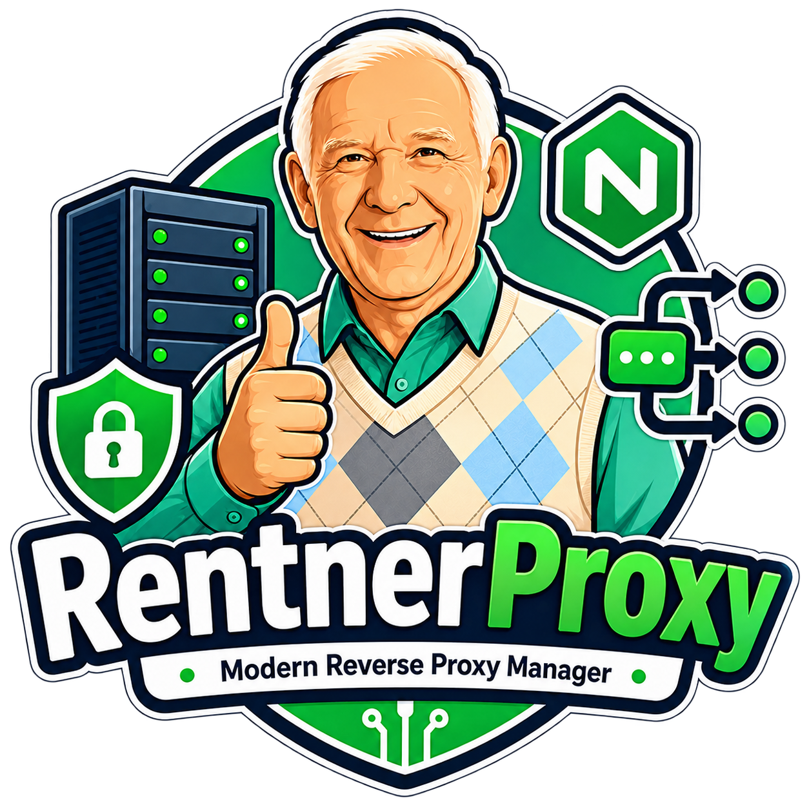
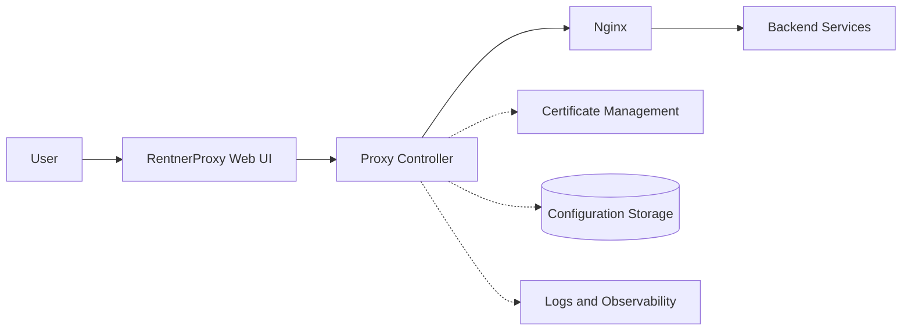

  

<h1 align="center">RentnerProxy</h1>

  <strong>Modern Reverse Proxy Manager</strong>

  A modern, self-hosted Nginx reverse proxy manager in the earliest stage of development, 
  released under the MIT License.

  Planned direction: TypeScript · TanStack Start · React · Bun · Docker · selective Rust

  
  
  
  
  
  

## 🚧 Coming Soon

> [!IMPORTANT]
> RentnerProxy is in active, early-stage development. It is not installable yet and is **not ready for production use**.

The repository foundation is currently being prepared. The first working components will follow as the architecture and development environment take shape.

## About RentnerProxy

RentnerProxy aims to rethink reverse proxy management with a modern web interface, a clean technical foundation, and a strong focus on self-hosting and open-source development.

The goal is to make everyday Nginx proxy management more approachable without taking visibility or infrastructure control away from experienced operators. The project is still defining its architecture, so no concrete feature set is promised yet.

## 🚧 Project Status

| Area | Status |
| --- | --- |
| Branding | ✅ Started |
| Repository foundation | 🚧 In progress |
| Architecture | 🚧 Planning |
| Web interface | ⏳ Planned |
| Proxy controller | ⏳ Planned |
| Nginx integration | ⏳ Planned |
| Docker deployment | ⏳ Planned |
| Documentation | 🚧 In progress |
| Licensing | ✅ MIT License |

At present, the repository contains the project branding and this initial documentation. Application code, runnable packages, deployment configuration, and releases have not been published yet.

## 🛠️ Planned Tech Stack

The following technologies describe the current direction, not the implemented state of the repository. The stack may change as the architecture is validated.

  
  
  
  
  
  
  

- **TypeScript, TanStack Start, and React** are planned for the web application.
- **Bun** is the planned JavaScript runtime and development toolchain.
- **Nginx** is the planned reverse proxy engine.
- **Docker and Docker Compose** are planned for packaging and self-hosted deployment.
- **Rust** may be used for dedicated low-level components where it provides a clear technical benefit; it is not intended to define the entire codebase.

## 🧩 Planned Architecture

This diagram is conceptual. The architecture is subject to change while the project is under active development.

## 🧭 Project Direction

The project is currently exploring the following areas. Every item below is planned and remains subject to design and implementation work.

- [ ] Reverse proxy management
- [ ] SSL certificate management
- [ ] Nginx configuration lifecycle
- [ ] Security integrations
- [ ] Access and traffic controls
- [ ] Logging and observability
- [ ] Docker-based deployment
- [ ] Backup and configuration management

## 🗺️ Roadmap

The roadmap describes direction only. It does not represent fixed release dates or committed delivery milestones.

### Phase 1 — Foundation

Define the project structure, architecture, development environment, and contribution basics.

### Phase 2 — Proxy Core

Explore reverse proxy configuration, validation, and the Nginx lifecycle.

### Phase 3 — Management Experience

Develop the planned web interface and investigate certificate and configuration workflows.

### Phase 4 — Security and Observability

Evaluate security integrations, access controls, logging, and operational visibility.

### Phase 5 — Community and Ecosystem

Expand documentation, contribution workflows, deployment guidance, and ecosystem integration as the project matures.

## Installation

There is no installable RentnerProxy build yet. Installation and development instructions will be added once the first usable development version is available.

## 📊 Repository

Live repository statistics are shown by the dynamic badges at the top of this page. No releases have been published yet.

| Resource | Link |
| --- | --- |
| Source | [Browse the repository](https://github.com/RentnerKev/RentnerProxy) |
| Issues | [Report a problem or share an idea](https://github.com/RentnerKev/RentnerProxy/issues) |
| Pull requests | [View proposed changes](https://github.com/RentnerKev/RentnerProxy/pulls) |
| Releases | [View future releases](https://github.com/RentnerKev/RentnerProxy/releases) |

GitHub Discussions are not currently enabled for this repository.

## ❤️ Open Source

RentnerProxy is being developed in public under the MIT License. Issues, pull requests, and community ideas are welcome as the project matures.

The MIT License applies to RentnerProxy's original project code and documentation. Third-party components, when added, will retain their own licenses and notices.

## 🤝 Contributing

Contributions are welcome as the project foundation takes shape. Because RentnerProxy is still at an early architectural stage, please [open an issue](https://github.com/RentnerKev/RentnerProxy/issues) before starting major features or structural changes.

Detailed contribution guidelines will be added as the project matures. Pull requests will be reviewed before they are merged.

## 📄 License

RentnerProxy is licensed under the [MIT License](./LICENSE).

Copyright (c) 2026 Kevin Sträßler.

---

  <strong>RentnerProxy</strong> 
  Modern Reverse Proxy Manager

  Being built in public, with open source in mind — and probably too much White Monster.

