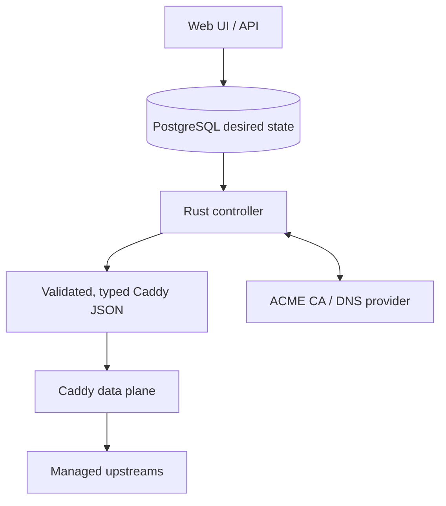

<p align="center">
  
</p>

<h1 align="center">RentnerProxy</h1>

<p align="center">
  <strong>Modern self-hosted reverse proxy management powered by Caddy.</strong>
</p>

<p align="center">
  RentnerProxy provides a web interface for proxy hosts, redirects, TLS certificates,
  access policies, logs, users, and runtime configuration, backed by a Rust controller
  and a Caddy data plane.
</p>

<p align="center">
  <a href="https://github.com/RentnerKev/RentnerProxy/actions/workflows/ci.yml"></a>
  <a href="https://github.com/RentnerKev/RentnerProxy/actions/workflows/codeql.yml"></a>
  <a href="https://www.bestpractices.dev/projects/14354"></a>
  <a href="https://github.com/RentnerKev/RentnerProxy/releases/tag/v1.0.0-alpha.6"></a>
  <a href="./LICENSE"></a>
</p>

> [!IMPORTANT]
> RentnerProxy is currently in **public alpha**. Breaking changes may still occur,
> backups before upgrades are strongly recommended, and this is not yet a stable 1.0 release.

## Quick start

### Requirements

- A `linux/amd64` host with Docker Engine and the Docker Compose plugin.
- Free host ports `80/tcp`, `443/tcp`, and `443/udp`.
- Inbound firewall access to those public traffic ports.
- An HTTPS management origin and working SMTP account.

The management UI is bound to `127.0.0.1:81` by default. PostgreSQL, Redis, the Rust
controller, and Caddy are included in the appliance.

### Install

Download [`docker-compose.yml`](./docker-compose.yml) and
[`.env.production.example`](./.env.production.example) into an empty directory, then:

```bash
cp .env.production.example .env
```

Edit `.env` and set these required values:

- `RENTNERPROXY_PUBLIC_ORIGIN` — the browser-facing HTTPS origin, for example
  `https://proxy-admin.example.com`.
- `SMTP_HOST`, `SMTP_USER`, `SMTP_PASSWORD`, and `SMTP_FROM`.
- `SMTP_PORT` and `SMTP_SECURE` if the supplied defaults do not match the SMTP server.

Validate and start the appliance:

```bash
docker compose config
docker compose up -d
```

The checked-in Compose file pins the immutable
`ghcr.io/rentnerkev/rentnerproxy:v1.0.0-alpha.6` image. Open
[`http://localhost:81`](http://localhost:81) on the Docker host and complete first-owner
setup. For a remote host, keep the management port private and use an SSH tunnel:

```bash
ssh -L 8181:127.0.0.1:81 user@server
```

Then open `http://localhost:8181`. Normal browser use, links in email, and passkeys should use
the configured `RENTNERPROXY_PUBLIC_ORIGIN`. Application state is stored in the persistent
`rentnerproxy` Docker volume.

### Release channel

For repeatable installs and upgrades, keep the exact version tag:

```text
ghcr.io/rentnerkev/rentnerproxy:v1.0.0-alpha.6
```

To follow the newest published alpha automatically, change the service image to the moving
channel:

```text
ghcr.io/rentnerkev/rentnerproxy:alpha
```

The `alpha` tag moves when a new alpha is published. Do not use `latest` before a stable
release; the [release policy](RELEASING.md#trigger-and-channels) reserves it for stable
versions.

## Current features

- **Proxying:** proxy hosts and redirect hosts through Caddy, with HTTP/1.1, HTTP/2,
  HTTP/3, and WebSocket support.
- **Certificates:** controller-managed ACME issuance and automatic renewal with HTTP-01 or
  Cloudflare DNS-01, wildcard certificates, manual certificate import, and durable retry and
  activation state.
- **Upstream security:** HTTPS upstream verification and reusable custom trusted CAs.
- **Access control:** reusable Access Policies with Basic Authentication and IPv4/IPv6
  allow/deny rules.
- **Administration:** users, roles, granular permissions, TOTP two-factor authentication,
  passkeys, and a read-only audit log.
- **Visibility:** recent proxy access logs, runtime status, certificate operation progress,
  and live WebSocket updates for active administration pages.
- **Operations:** persistent desired state, revision-checked Caddy reconciliation, and
  repository-provided backup and restore tooling.
- **Interface:** light and dark themes plus English, German, Spanish, and French
  translations.

<!--
## Screenshots

Add only sanitized captures from the current public alpha:

| Overview | Proxy Hosts |
| --- | --- |
| image | image |

| Certificate Management | Access Logs |
| --- | --- |
| image | image |
-->

## Architecture



The management service owns user-facing state and permissions. The controller validates the
desired proxy model, renders Caddy JSON, applies it through a private admin socket, and confirms
the active revision. Certificate private material and ACME lifecycle state remain
controller-owned. See [`ARCHITECTURE.md`](ARCHITECTURE.md) for the complete service, trust, and
persistence boundaries.

## Security and trust

RentnerProxy uses typed proxy configuration rather than accepting arbitrary raw Caddy JSON.
Management operations pass through authentication and role-based authorization; TOTP and
passkeys are available for account protection. Controller-owned certificate storage,
revision-probed configuration changes, strict trusted-proxy handling, security headers, and
backup/restore verification provide additional layers.

Repository automation includes CI, CodeQL, secret scanning, dependency review, and OpenSSF
Scorecard analysis. These controls are evidence, not a security certification. Read the
[security policy](SECURITY.md) and the repository-backed
[assurance case](ASSURANCE_CASE.md) for supported versions, assumptions, and residual risks.
Report vulnerabilities through the private process in `SECURITY.md`, never through a public
issue.

## Project status

[`v1.0.0-alpha.6`](https://github.com/RentnerKev/RentnerProxy/releases/tag/v1.0.0-alpha.6)
is the current public alpha. RentnerProxy is usable for testing and non-critical deployments,
but it has not reached its first stable release and should not be presented as production-ready
for critical traffic.

Before Beta 1, the project is focusing on security review, upgrade and migration compatibility,
runtime reliability, backup/restore hardening, accessibility, and tester feedback. Back up the
complete appliance state before every upgrade.

## Planned for Beta 1

The following are planned work, not current feature claims:

- [CrowdSec integration](https://github.com/RentnerKev/RentnerProxy/issues/64).
- [Forward Auth access policies](https://github.com/RentnerKev/RentnerProxy/issues/65).
- [Nginx Proxy Manager importer](https://github.com/RentnerKev/RentnerProxy/issues/66).
- Broader upgrade, recovery, compatibility, reliability, scale, security, and accessibility
  validation.

There is no promised release date. The [roadmap](ROADMAP.md) and
[Beta 1 release gate](https://github.com/RentnerKev/RentnerProxy/issues/75) track the current
scope.

## Help test RentnerProxy

RentnerProxy is looking for testers before Beta 1. Particularly useful feedback covers:

- Fresh installations and upgrades from earlier alphas.
- Backup, restore, and rollback on disposable test data.
- Different Docker hosts and upstream applications.
- HTTP-01, Cloudflare DNS-01, wildcard, renewal, and imported-certificate flows.
- IPv4, IPv6, HTTP/3, trusted-proxy, and TLS-terminating proxy setups.
- UI, accessibility, translation, and general usability problems.

Report reproducible bugs with the
[GitHub issue forms](https://github.com/RentnerKev/RentnerProxy/issues/new/choose). Remove
credentials, private domains, internal addresses, and unrelated sensitive data first. Report
security vulnerabilities privately as described in [`SECURITY.md`](SECURITY.md).

## Deployment notes

### TLS termination in front of managed hosts

When another proxy terminates public HTTPS and forwards HTTP to RentnerProxy, set
`RENTNERPROXY_PROXY_TRUSTED_PROXY_CIDRS` in the production `.env` to that proxy's direct
socket-peer addresses:

```dotenv
RENTNERPROXY_PROXY_TRUSTED_PROXY_CIDRS=192.0.2.10/32,2001:db8::10/128
```

The setting is empty by default. Use only the narrowest stable addresses; all-address (`/0`)
and IPv4-mapped IPv6 ranges are rejected. Configure the terminating proxy to overwrite
`X-Forwarded-Proto` from the actual connection. This Caddy data-plane setting is separate from
`RENTNERPROXY_TRUST_PROXY_HEADERS` for the management application. Preserve deployment
settings alongside backups because they are not stored in PostgreSQL.

### Upgrade

Create a production backup, change the Compose image to the target exact release, then pull and
recreate:

```bash
docker compose pull
docker compose up -d
```

Check container health, the management UI, certificate state, and configured hosts after the
upgrade.

### Backup and restore

The repository tools require Bun 1.4.2, Docker Compose, and a repository checkout. Run them with
the installation's Compose file and project name:

```bash
export RENTNERPROXY_COMPOSE_FILE=/srv/rentnerproxy/docker-compose.yml
bun --env-file=/srv/rentnerproxy/.env scripts/production-backup.ts \
  --project rentnerproxy --output /srv/rentnerproxy-backups
```

Backup briefly stops and then restarts the appliance. Keep the entire backup directory,
Compose file, and private `.env` outside the appliance volume. The backup contains PostgreSQL,
controller and certificate state, and the application encryption key; Redis, proxy request
logs, and deployment environment variables are excluded.

For rollback, restore the pre-upgrade backup into fresh volumes with the previous exact image.
Never run an older image against an upgraded database:

```bash
export RENTNERPROXY_COMPOSE_FILE=/srv/rentnerproxy-recovery/docker-compose.yml
bun --env-file=/srv/rentnerproxy/.env scripts/production-restore.ts \
  --project rentnerproxy-recovery \
  --input /srv/rentnerproxy-backups/BACKUP_DIRECTORY --confirm-replace
```

Restore replaces the target project's data. Stop the original appliance before a recovery
project reuses the same host ports, and retain its volumes until recovery is verified.

## Contributing

Contributions, reproducible bug reports, and testing feedback are welcome. Please read the
[contribution guide](CONTRIBUTING.md), follow the [Code of Conduct](CODE_OF_CONDUCT.md), check
the [roadmap](ROADMAP.md), and use the private process in [`SECURITY.md`](SECURITY.md) for
vulnerabilities.

## Project documentation

- [Architecture](ARCHITECTURE.md)
- [Security policy](SECURITY.md) and [security assurance case](ASSURANCE_CASE.md)
- [Contributing](CONTRIBUTING.md), [Code of Conduct](CODE_OF_CONDUCT.md), and
  [governance](GOVERNANCE.md)
- [Roadmap](ROADMAP.md)
- [Release process](RELEASING.md)

RentnerProxy is available under the [MIT License](LICENSE).
