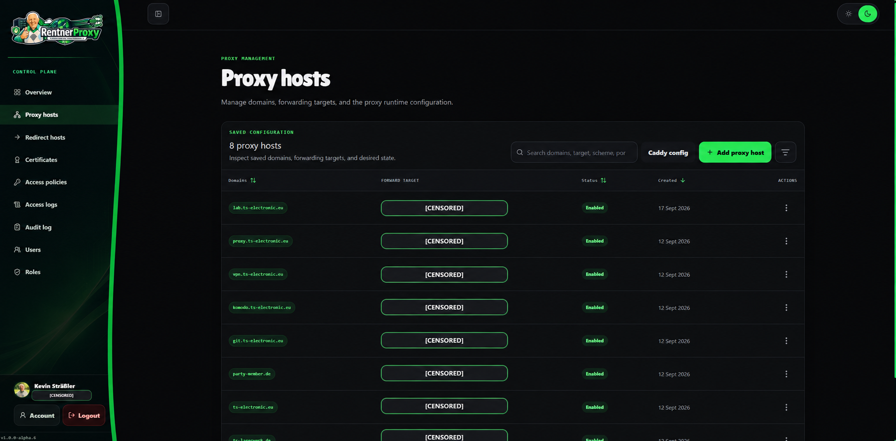
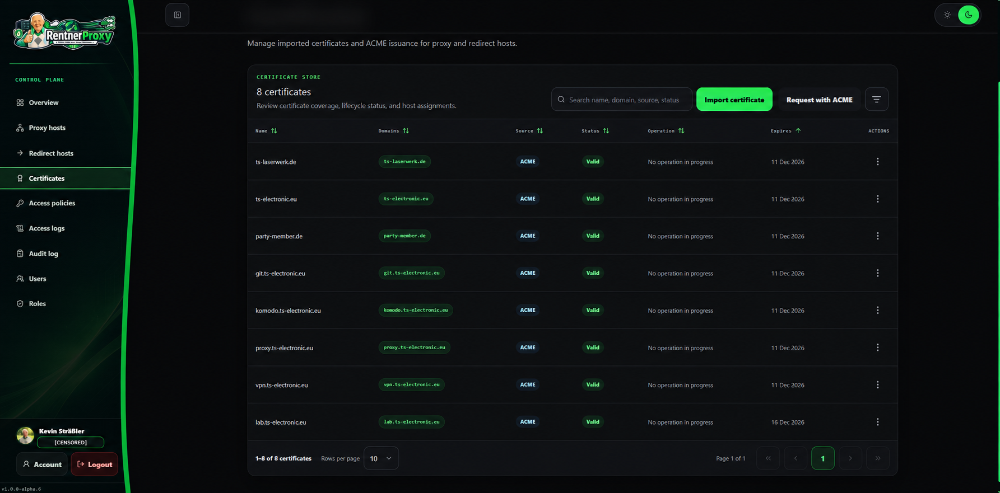
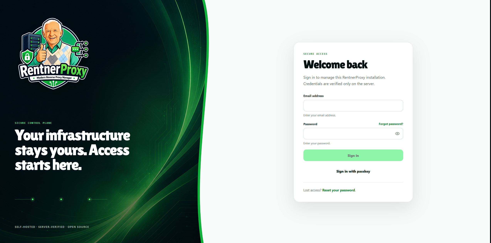
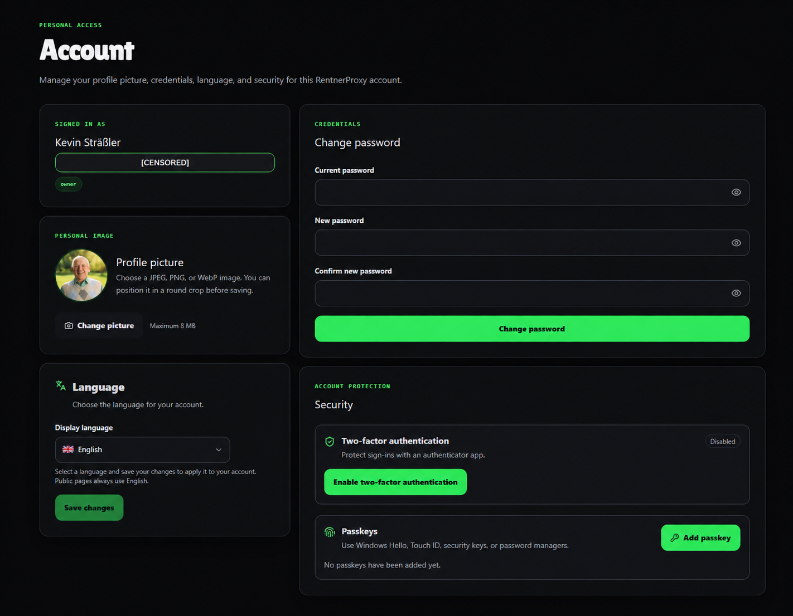

<p align="center">
  
</p>

<h1 align="center">RentnerProxy</h1>

<p align="center">
  <strong>Modern self-hosted reverse proxy management powered by Caddy.</strong>
</p>

<p align="center">
  <a href="https://github.com/RentnerKev/RentnerProxy/actions/workflows/ci.yml"></a>
  <a href="https://github.com/RentnerKev/RentnerProxy/actions/workflows/codeql.yml"></a>
  <a href="https://www.bestpractices.dev/projects/14354"></a>
  <a href="https://github.com/RentnerKev/RentnerProxy/releases/tag/v1.0.0-alpha.6"></a>
  <a href="./LICENSE"></a>
</p>

> [!IMPORTANT]
> Public alpha: breaking changes are possible. Back up your data before upgrades.

## Features

- Proxy hosts and redirects with HTTP/2, HTTP/3, and WebSocket support.
- Duplicate proxy and redirect hosts into a draft with new domains, using existing creation, certificate and access-policy validation. Proxy copies inherit global HTTP settings; separate per-host Config overrides are not copied.
- Global quick search with Ctrl+K on Windows/Linux and Cmd+K on macOS, plus a mobile search control. Find authorized hosts, certificates, access policies and settings with bounded results and keyboard navigation.
- Automatic TLS via ACME (HTTP-01 or Cloudflare DNS-01), wildcard and imported certificates.
- Access policies with Basic Auth, Forward Auth, and IP allow/deny rules; verified HTTPS upstreams.
- CrowdSec protection: managed or external Local API, optional community/Console connection, and a dedicated security dashboard in the development image.
- Users, roles, permissions, TOTP, passkeys, and audit logs.
- Personal accent colors and light/dark themes; login and public pages retain the default green.
- Live status and access logs; English, German, Spanish, French, Italian, Portuguese, Dutch, and Polish UI.
- Single-container appliance with Caddy, PostgreSQL, Valkey, and a Rust controller.

## Installation

Requirements:

- `linux/amd64` host with Docker Engine and Docker Compose.
- Free ports `80/tcp`, `443/tcp`, and `443/udp`.
- HTTPS management origin and SMTP credentials.

Select a Valkey-based RentnerProxy image with `RENTNERPROXY_IMAGE`. The example uses a local build
from this checkout. Build it before starting the appliance:

```bash
docker build --file docker/production/Dockerfile --tag rentnerproxy:local .
```

Save this as `docker-compose.yml` (or use the [repository file](docker-compose.yml)):

```yaml
services:
    rentnerproxy:
        image: ${RENTNERPROXY_IMAGE:?Set RENTNERPROXY_IMAGE to a Valkey-based RentnerProxy image}
        environment:
            RENTNERPROXY_PUBLIC_ORIGIN: ${RENTNERPROXY_PUBLIC_ORIGIN:?Set RENTNERPROXY_PUBLIC_ORIGIN}
            RENTNERPROXY_PROXY_TRUSTED_PROXY_CIDRS: ${RENTNERPROXY_PROXY_TRUSTED_PROXY_CIDRS:-}
            SMTP_FROM: ${SMTP_FROM:?Set SMTP_FROM}
            SMTP_HOST: ${SMTP_HOST:?Set SMTP_HOST}
            SMTP_PASSWORD: ${SMTP_PASSWORD:?Set SMTP_PASSWORD}
            SMTP_PORT: ${SMTP_PORT:-587}
            SMTP_SECURE: ${SMTP_SECURE:-false}
            SMTP_USER: ${SMTP_USER:?Set SMTP_USER}
        ports:
            - '80:8080'
            - '127.0.0.1:81:3000'
            - '443:8443/tcp'
            - '443:8443/udp'
        restart: unless-stopped
        stop_grace_period: 30s
        volumes:
            - rentnerproxy:/var/lib/rentnerproxy

volumes:
    rentnerproxy:
```

Create `.env` beside it (see also [`.env.production.example`](.env.production.example)):

```dotenv
RENTNERPROXY_IMAGE=rentnerproxy:local
RENTNERPROXY_PUBLIC_ORIGIN=https://management.example.com
SMTP_HOST=smtp.example.com
SMTP_PORT=587
SMTP_SECURE=false
SMTP_USER=rentnerproxy@example.com
SMTP_PASSWORD=replace-me
SMTP_FROM=RentnerProxy <rentnerproxy@example.com>

# Optional: only the direct IP/CIDR of a trusted proxy in front of RentnerProxy.
# RENTNERPROXY_PROXY_TRUSTED_PROXY_CIDRS=192.0.2.10/32
```

Start the appliance:

```bash
docker compose config
docker compose up -d
```

- Complete first-owner setup at `http://localhost:81`. For a remote host, keep port 81 private and use `ssh -L 8181:127.0.0.1:81 user@server`.
- Use the configured HTTPS `RENTNERPROXY_PUBLIC_ORIGIN` for normal access, email links, and passkeys.
- Application data lives in the persistent `rentnerproxy` Docker volume.

During restart or recreation, the controller recovers supported persisted proxy snapshots after
preparing CrowdSec, before waiting for PostgreSQL and Valkey. Existing HTTP/HTTPS routes can serve
while those independent services recover; management readiness still waits for the database,
cache and migrations. Fresh installations and unsupported snapshot versions use the safe default
site until the application reconciles their configuration. Replacing a single appliance container
still interrupts its connections and listeners; this startup order does not provide zero downtime.

## Docker images

RentnerProxy images are published to `ghcr.io/rentnerkev/rentnerproxy`.

| Tag | Channel |
| --- | --- |
| `:latest` | Latest stable release |
| `:beta` | Latest beta release |
| `:alpha` | Latest alpha release |
| `:dev` | Development build from `main` for testing new and potentially unstable changes |

Every release is also published with its exact version tag. Use an exact tag when you want to pin
a specific release, for example:

```text
ghcr.io/rentnerkev/rentnerproxy:v1.0.0
ghcr.io/rentnerkev/rentnerproxy:v1.0.0-beta.1
ghcr.io/rentnerkev/rentnerproxy:v1.0.0-alpha.6
```

Moving channel tags such as `:latest`, `:beta`, and `:alpha` always follow the newest release
in that channel. `:dev` is not a release and may change at any time.
## CrowdSec (development image)

- **Managed:** local detection and blocking work without a CrowdSec account; community intelligence and Console enrollment are separate opt-ins.
- **External:** connect an existing CrowdSec Local API with a bouncer key.
- **Disabled:** default; existing traffic behavior is unchanged.
- Flags use a bundled country-only MMDB. A mounted GeoLite2 Country file can be selected with the optional `RENTNERPROXY_GEOIP_COUNTRY_DB_PATH` (absolute path; maintain its license and updates).
- Enforcement is fail-open when the selected Local API is unavailable.
- Repository backup v4 includes the managed CrowdSec SQLite database, decisions, local API registration, optional Central API/Console credentials and managed bouncer key. External CrowdSec configuration and its encrypted credential are in PostgreSQL; the external LAPI remains operator owned.

## Basic Auth (development image)

Create an Access Policy, choose **Authenticated** and **Basic Auth**, enter a username and password, and save. The policy and its first account are saved together and applied automatically. Select the policy on the proxy host and save the host to require these credentials when visiting the site. If the controller is unavailable, the UI reports that applying the saved configuration is still pending. Use **Credentials** in the policy list to change credentials or add more accounts. Passwords are stored as Argon2id hashes and are never returned to the browser. Use HTTPS on protected hosts.

## Forward Auth (development image)

Forward Auth is configured inside an existing Access Policy. Choose a provider preset, enter its full HTTP or HTTPS check endpoint, and select the request credentials and identity response headers needed by that provider. Basic Auth and Forward Auth are mutually exclusive in one policy. An IP rule can be combined with Forward Auth only when **all** checks must pass. The auth check is fail closed: a denied response or unreachable gateway never grants access to the protected upstream. HTTPS auth gateways use normal certificate verification; the endpoint cannot contain credentials or a query string.

Provider reachability is not measured by the Security Dashboard; it reports configured policy counts and settings only.

## Default Site (development image)

Open **Operations** in the main navigation to choose the Default Site response for the server's IP address or a hostname
with no active Proxy Host or Redirect Host. Existing installations keep the empty HTTP 404 response
until an administrator saves another mode. Owners and administrators have the dedicated
`default_site.view` and `default_site.update` permissions; saving also requires `proxy_hosts.apply`.
Custom roles may receive these permissions through role management.

| Mode             | Unmatched request behavior                                                                              |
| ---------------- | ------------------------------------------------------------------------------------------------------- |
| 404              | HTTP 404, preserving the existing default.                                                              |
| Welcome page     | Built-in RentnerProxy HTML page, HTTP 200.                                                              |
| Close connection | Caddy aborts the connection without an HTTP response. No HTTP 444 is sent.                              |
| Redirect         | HTTP 302 to the exact configured absolute HTTP/HTTPS URL; the incoming path and query are not appended. |
| Custom HTML      | The saved HTML, HTTP 200 with `Content-Type: text/html; charset=utf-8`.                                 |

Custom HTML is limited to 256 KiB of UTF-8 text. Edit it as source on the Operations page; it is never rendered
inside the management UI. The public page uses a sandboxed Content Security Policy: scripts,
forms, frames and navigation privileges are disabled; inline styles and HTTP/HTTPS/data images
are allowed. Caddy placeholders, including `{env.*}` and `{file.*}`, are served literally.
Redirect targets reject credentials, control characters and unsupported URL schemes. HTML and
redirect responses disable caching. The close mode follows Caddy's
[abort behavior](https://caddyserver.com/docs/caddyfile/directives/abort), which also interrupts
other active HTTP streams on the same connection.

For HTTP, point the hostname's DNS record at the server or open its IP address on the published
HTTP port. Existing hosts, redirects and access policies take precedence; ACME challenge handling
and the separate management endpoint remain in their existing routing paths.

HTTPS requires a successful TLS handshake before any Default Site response can be delivered.
This setting does not request a certificate, add a default certificate, enable on-demand TLS or
expand the configured SNI policies. The HTTPS listener exists only when a configured host has
certificate material. Unknown names and IP addresses normally fail the handshake, and a Host/SNI
mismatch is still rejected. A Default Site selection cannot solve these certificate limitations;
configure a host and a suitable certificate when visitors need HTTPS for that address.

The selected mode and custom HTML are durable PostgreSQL settings, included in the supported
appliance backup/restore. The controller also persists the active snapshot for restart recovery.
Saving reports when runtime application is pending; the existing reconciliation worker retries
automatically. Reload Operations after a configuration conflict before saving another edit.
Portable host configuration exports do not include these global settings.

## Screenshots

<p align="center">
  
  
</p>

<p align="center">
  
  
</p>

## More information

- [Architecture](ARCHITECTURE.md) · [Security policy](SECURITY.md) · [Assurance case](ASSURANCE_CASE.md)
- [Runtime support report](RUNTIME_SUPPORT_REPORT.md)
- [Release process](RELEASING.md) · [Contributing](CONTRIBUTING.md)
- [Proxy host setup guide](PROXY_HOST_SETUP.md)
- [Screenshots](screenshots) · [Report a bug](https://github.com/RentnerKev/RentnerProxy/issues/new/choose)

Licensed under [MIT](LICENSE).

## Backup and recovery

Run `bun run backup:production -- --project <project> --output <directory>` with the current checkout and the deployment's Compose environment. The appliance is stopped while PostgreSQL, controller/certificate state, the application encryption key and managed CrowdSec state are captured together, then restarted. Keep the completed backup directory outside the appliance volume. Its manifest records SHA-256 checksums, the source image identity, public origin and trusted proxy CIDRs; the directory is private (0700) and its files are 0600 on Linux. Checksums detect corruption, so retain backups in trusted storage.

Restore with `bun run restore:production -- --project <project> --input <backup> --confirm-replace`. Restore validates the complete manifest and immutable copies of every artifact before stopping the target. It rejects unsafe archive members, incompatible migration history, corrupted databases and application keys that cannot decrypt persisted secrets. Archive extraction uses private staging directories and repairs ownership before startup. The restored desired configuration is reconciled by the controller; verify the appliance health and actual proxy traffic before accepting recovery.

Supported restore sources are current v4 backups into the same current database version, and authentic v3 backups from the pinned published Alpha 4, Alpha 5 and Alpha 6 images into the current target. The [release compatibility matrix](scripts/release-compatibility/run.ts) creates each source backup with that release's own tools, verifies fresh-volume restores and exact-source fresh-volume rollback. Format v1/v2, other releases and downgrades are unsupported; changing a manifest version does not make a backup compatible. Alpha v3 archives predate managed CrowdSec. They initialize CrowdSec on a fresh target and leave any existing CrowdSec directory in place; they cannot recover lost decisions.

Keep the Compose file, image tag/digest, port mappings and deployment environment alongside the backup, including SMTP credentials, canonical public origin and trusted proxy CIDRs. Environment secrets are deliberately absent from the manifest. A v4 restore checks the origin and CIDRs against the target; legacy v3 restores require explicit deployment review with `--allow-deployment-change`. Use that option for an intentional environment change only after reviewing authentication, forwarded-client trust and external integration reachability.

Valkey challenge/rate-limit/realtime state, request logs, sockets, PID files, locks, temporary files and supervisor status/staging are excluded. Cache-backed flows restart after restore; durable users, sessions, roles, permissions, policies, Basic Auth, Forward Auth, importer history, hosts, redirects, CAs, certificate jobs/events/retries, candidates, ACME accounts and encrypted DNS credentials remain in PostgreSQL/controller state. Backup v4 retains its historical `redis: "excluded"` manifest field for compatibility; it describes the transient cache exclusion for both engines. CrowdSec's SQLite WAL is retained when present, while its shared-memory file is regenerated. Managed startup re-registers the bouncer with a private key and preserves detections and registrations; the LAPI remains bound to loopback.

If restore is interrupted after replacement begins, the persistent journal prevents startup with partially restored state. Stop the appliance if it was manually started and rerun the same backup with `--resume --confirm-replace`. Resume validates that backup again and repeats all replacement steps. Another backup is rejected while the journal is pending. A failure before replacement leaves the running target intact; no automatic destructive retry is attempted. For rollback, use a fresh volume, the pre-upgrade source backup, that source release's restore tools and its exact image digest.

## Proxy scale and concurrency checks

With the same Docker/Bun prerequisites as the reliability fixture, run:

```bash
bun run runtime:scale -- --hosts 100 --concurrency 4 --rounds 3 --seed 70 --report ./runtime-scale.json
```

The isolated fixture builds committed `HEAD` and bundles services from that exact revision. A supplied
`--image` must carry the matching OCI revision. It grows from 25 to 100 proxy hosts, with two domains
per host, 25 redirects, ten policies, ten wildcard-certificate bindings and a trusted upstream CA.
Each seeded round changes upstreams, disables/enables hosts and updates redirects while management
reads and HTTP traffic continue. Independent patches to the same policy must both survive. Final
persisted fields, IDs, domains, assignments, desired revision, active controller revision, Caddy JSON
and every route are checked. The feature phase also exercises Basic/IP policies, managed CrowdSec,
Forward Auth with combined IP restrictions, TLS/HTTP3, ACME issuance/renewal
and a durable certificate-binding retry, plus a
20-row NPM import and identical-source retry. An unavailable Caddy Admin socket must preserve the
last verified routes on a failed apply. The fixture briefly pauses its own web process to prevent
automatic background retries from racing that checkpoint. For this one fault probe the fixture
stops its own reconciler before mutation, asserts a pending response and makes one explicit apply
through the normal controller client, which must fail. Normal concurrent rounds use the production
reconciler unchanged. The web process is resumed in a finally block. Appliance restart must
apply the pending intent without losing IDs or import
history. Deletion removes a subset and checks their absent routes.

Bounds are `--hosts 1..100`, `--concurrency 1..8`, `--rounds 1..5`, uint32 `--seed` (default 70), and
`--timeout-seconds 30..900` (default 600, excluding cold image setup). Each command and recovery wait
is also bounded; an admitted phase finishes before cleanup, so the elapsed time can exceed the guard.
Small overrides proportionally reduce policies, redirects and NPM rows. Reports contain only
allowlisted counts, timings, resource analyses, commit/image identities and static failure categories;
the private fixture data is cleaned up. Image builds can require more time than the workload.

The appliance is constrained to 1 GiB, two CPUs and 512 PIDs; PostgreSQL connection evidence is bounded
at 100. CPU usage is reported, without a throughput target. Configuration growth is measured
separately from eight samples with unchanged final geometry. Only those final samples are compared
for connection/FD growth and sustained memory growth, using the existing reliability allowances
(`4 × concurrency + 16` connections/FDs and 128 MiB sustained memory growth). These short checks can
detect regressions in this workload; they establish neither universal capacity nor long-term leak
freedom. The [Runtime Scale workflow](.github/workflows/runtime-scale.yml) runs this bounded case on
relevant PR/main changes and manually. It has no long-duration profile or schedule. Release soak
evidence remains a separate check.

A Docker Desktop reference run on Windows with Bun 1.4.2 at
[`1aba761`](https://github.com/RentnerKev/RentnerProxy/commit/1aba761419c73877a35474240f1979f93124d0aa)
passed the default case in 379 seconds after image setup. The 25-host creation command took 1.13 s,
growth to 100 took 2.51 s, and each concurrent fixture command took 7.73–7.92 s for 328 mutations and
407 management reads; these command timings exclude subsequent traffic/revision checks. NPM import
raised the inventory to 110 proxy hosts and 35 redirects. Sampled maxima were 205 MiB, 51% CPU,
54 PIDs, 11 PostgreSQL connections and 23/12/163 web/controller/Caddy FDs. Across the eight unchanged
final samples, connections and web/controller FDs stayed constant, Caddy FDs decreased by five and
memory increased by 3.4 MiB. This observed cost supports the bounded 100-host default within the
600-second guard on that test setup. The samples are not instantaneous peaks or production limits;
retain each CI run's own report for its exact revision and environment.

## Runtime reliability checks

With Docker Engine (Linux containers), Docker Compose, Bun 1.4.2, Git history and the repository
dependencies installed, run the isolated synthetic fixture:

```bash
bun run runtime:reliability -- --profile short --source current --report ./runtime-reliability.json
bun run runtime:reliability -- --profile long --source alpha.6 --report ./runtime-reliability-alpha6.json
```

`current` builds the committed `HEAD` snapshot; fixture services are bundled from the exact matching
Git revision. A supplied `--image` for current is accepted only when its OCI revision matches `HEAD`.
`alpha.6` uses the immutable published Alpha 6 image and its pinned historical source. The fixture creates its own private data and credentials. Never supply production
secrets or private data. Cycle admission stops at the first duration or iteration bound: short defaults
to 120 seconds/3 iterations, long to 1800 seconds/120 iterations, both with concurrency 2. The sanitized
JSON records actual workload elapsed time, excluding cold setup, and whether the requested duration was
reached. In-flight cycles finish their bounded commands, so observed duration can exceed the admission
cap. Retain at least eight quiescent samples for trend evidence; a shorter passing run cannot establish
resource stability. These are fixture guards, not production performance benchmarks. The separate
[Runtime Reliability workflow](.github/workflows/runtime-reliability.yml) runs short checks for relevant
PR/main changes and long current/Alpha 6 checks weekly or manually. See [Architecture](ARCHITECTURE.md)
for resource evidence limits and [Releasing](RELEASING.md) for the exact-ref release gate.

Override bounds with `--duration-seconds 30..7200`, `--iterations 1..1000` and `--concurrency 1..8`
(using one integer, not a range). `--seed` accepts a uint32 (default 69) for repeatable fixture choices;
`--capture-resources true|false` controls sampling (default true). CI manual inputs expose the same
controls. A manual duration override receives a four-hour CI job budget per source, including cold
setup and completion of the last bounded cycle; the default workload durations stay the same.
Disabling resource capture cannot establish resource stability.

The published Alpha 6 baseline has a known certificate-binding retry defect: an accepted asynchronous
retry can leave the job failed while the controller completes issuance. The fixture records
`alpha6-binding-retry-needs-second-request` in `knownLimitations` only for the verified known state,
then sends one bounded second retry for the same job. This represents an additional operator action;
a passing baseline accounts for that limitation. Current builds must complete after one retry and
report no known limitations. See [Releasing](RELEASING.md) for the required evidence.
