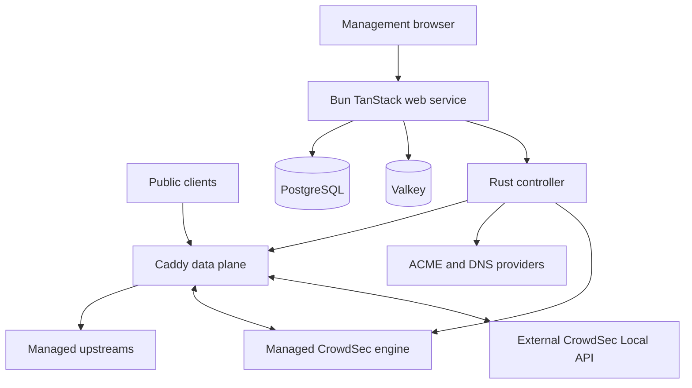

# RentnerProxy architecture

RentnerProxy is a public-alpha self-hosted reverse-proxy manager. The production
appliance is one Docker container with a Bun/TanStack management service, a Rust
controller, Caddy, PostgreSQL, and Valkey. The deployment and support posture is
described in [`README.md`](../README.md), [`SECURITY.md`](../SECURITY.md), and
[`CONTRIBUTING.md`](../.github/CONTRIBUTING.md). This document describes the implementation
in this repository; it is not a promise of a particular release or deployment.

## Runtime shape

The Rust controller lives in `core/`, and the management application lives in `web/`.
JavaScript tooling lives at the repository root: `package.json`, `bun.lock`,
`vite.config.ts`, `tsconfig.json`, `tsconfig.scripts.json`, the OXC configuration,
and `drizzle.config.ts`. Vite uses `web/` as its application root. Cargo manifests,
the Rust lockfile, source, and tests belong to `core/`.
Web unit and integration tests mirror their source owners under `web/src/tests/`.
Docker production smoke entrypoints live in `.github/scripts/` alongside their CI runner;
shared development, build, and smoke helpers remain under `scripts/`.

The production image and its pinned base components are assembled in
[`docker/production/Dockerfile`](../docker/production/Dockerfile). The supervisor
in [`docker/production/entrypoint.sh`](../docker/production/entrypoint.sh) starts
PostgreSQL on loopback, an intentionally non-durable local Valkey, the controller
on `127.0.0.1:8081`, and the Bun server on port `3000`. Caddy is started by the
controller and listens on the internal HTTP/TLS ports. The Compose mapping in
[`docker-compose.yml`](../docker-compose.yml) exposes managed traffic on host
ports 80 and 443 and binds the management UI to host loopback port 81.
The web service, controller, and PostgreSQL processes use separate Unix users and
private directories in the appliance image; the controller-to-Caddy admin and
runtime-probe sockets are also private filesystem endpoints. Caddy runs as a child of the
controller with the same Unix identity; they are not isolated security principals. Public proxy traffic
therefore reaches Caddy through the published data-plane ports, while management
traffic reaches Bun through the loopback-bound port.

### Management service

The source boundary follows `routes → features → middleware.ts → server services`.
Feature `middleware.ts` files own Server Function methods, validation, authorization,
rate limits, and service delegation; raw API routes retain explicit server-only
adapters. Business logic, persistence, integrations, and WebSocket server transport
live under `web/src/server/`, including `server/Auth/transport.server.ts` for HTTP
authentication errors, statuses, client IP resolution, and timing protections.

Screens and complex components render from one public `use...Logic` hook, with
named `state` and `handler` groups and native `form`/`table` instances when needed.
Focused hooks share lifecycle responsibilities without creating another screen
orchestrator. Tables, forms, and modals own their supporting `Hooks/`, `Types/`, and
`Components/` directories. Public and authenticated shells live in
`web/src/layouts/PublicLayout/` and `web/src/layouts/AuthenticatedLayout/`.

UI-free domain utilities and cache operations live under `web/src/lib/`;
declarative policy and configuration live under `web/src/config/`. Reusable
language and theme UI lives in `web/src/shared/Language/` and
`web/src/shared/Theme/`, with pure computations and language resources in
`lib/Language/` and `lib/Theme/`. Browser realtime code and event contracts belong
to `lib/Live/`; server realtime transport belongs to `server/WebSockets/`.
Cross-area imports use the `@/` alias for `web/src/`, while local imports keep
explicit TypeScript file extensions. Tests mirror these owners under
`web/src/tests/`. Property-based tests use `.fuzz.test.ts` and database integration
tests use `.db.test.ts` in the mirrored hierarchy; ordinary test runs exclude both.
The WebSocket runtime is bundled alongside the server build, so the Docker image
ships built artifacts without relying on source imports or development aliases.

Type definitions live under their owner's `Types/` directory. Configuration
contracts belong to `config/Types/`. UI-free domain
contracts belong to `lib/Auth/Types/`, `lib/AccessPolicies/Types/`,
`lib/Admin/<domain>/Types/`, and the other domain owners. Rendering and hook
contracts belong to their feature, component, or shared UI owner. Callers import
the defining module directly; the old shared helper compatibility wrappers are removed.
There is no root contracts directory. SQL schema definitions and migrations are unchanged.
`db/schema.ts` is the single schema assembly required by the ORM and migration
configuration; there is no additional schema index wrapper.

Controller HTTP integrations live in `server/Controller/`: one bounded bearer
transport and separate adapters for health, proxy configuration, certificates,
trusted CAs, CrowdSec, and access logs. Response schemas and their inferred types
remain with these adapters. `server/Foundation/` combines dependency health;
`server/Valkey/` owns the Valkey connection and storage operations. React Query
client construction belongs to `lib/TanstackQuery/`, while its provider remains
in `integrations/TanstackQuery/`. Shared realtime hooks live in `shared/Live/Hooks/`.

The web application is TanStack Start/React running under Bun. Server functions
implement authentication, authorization, users, roles, proxy-host and redirect
configuration, policies, certificates, audit history, and settings. The service
uses Drizzle over Bun SQL for PostgreSQL, as shown by
[`web/src/db/index.ts`](../web/src/db/index.ts) and the schema under
[`web/src/db/Schema/`](../web/src/db/Schema). Migrations take a PostgreSQL
advisory lock and synchronize the authorization registry in
[`web/src/db/migrate.ts`](../web/src/db/migrate.ts).

Language, theme, and navigation-group expansion are per-user preferences in the existing
`user_settings` row. Navigation stores explicit expanded/collapsed booleans under stable group
IDs. Session resolution restores them without an extra preference request. Missing values keep
the current active-section default; explicit choices take precedence on route changes. Unknown
or malformed values are ignored when reading, and permissions only control group visibility:
hiding a group retains its preference. Desktop and mobile menus share optimistic updates.
Each intentional toggle saves one idempotent group change; an atomic JSONB merge preserves
other groups and sibling settings, including concurrent changes from another tab. The mutation
requires application access and rejects a request queued for a different signed-in user. Failed
saves restore the last confirmed value and show a localized error. Rendering, route navigation,
and localization changes do not save preferences. These controls do not affect server-side RBAC.

Accent colors are also personal preferences. The existing JSONB settings store holds a strict
versioned value at `user_appearance_v1:<user UUID>`, resolved alongside authenticated user access.
Saving requires application access and the expected signed-in user ID; users can only change
their own color. The document uses the authenticated route's color, including in its initial
server HTML. Login and all public routes always use the default green. Public requests never
load an accent preference, and the former global `system_appearance_v1` value is ignored.
Router invalidation reloads a saved color without a document-wide override surviving logout or
account switches. Existing backups preserve the per-user values through their full database dump.

Valkey is a local connection used for rate limiting, authentication challenges,
and cross-process application-change notifications. The client and its reconnect
behavior are in [`web/src/server/Valkey/client.server.ts`](../web/src/server/Valkey/client.server.ts);
the realtime service publishes and subscribes to the `rentnerproxy:realtime` channel in
[`web/src/server/WebSockets/realtimeValkey.service.ts`](../web/src/server/WebSockets/realtimeValkey.service.ts).
Valkey is not the source of truth and is deliberately run without persistence by
the production entrypoint.

The Bun server exposes HTTP and one authenticated, origin-checked native WebSocket
endpoint per browser tab. WebSocket subscriptions sample the same server-side
snapshots used by HTTP and enforce connection, payload, subscription, message-rate,
and backpressure limits. The transport is assembled in
[`docker/web/serve.mjs`](../docker/web/serve.mjs) and
[`web/src/server/WebSockets/realtimeWebSocket.ts`](../web/src/server/WebSockets/realtimeWebSocket.ts).

### Rust controller and Caddy

The Rust service is an Axum HTTP controller. Its internal routes are protected by
the controller bearer token when configured; a non-loopback controller refuses to
start without one. Route registration and authorization are in
[`core/src/server/mod.rs`](../core/src/server/mod.rs) and
[`core/src/server/auth.rs`](../core/src/server/auth.rs), and the
configuration checks are in [`core/src/config.rs`](../core/src/config.rs).

The controller validates the desired proxy model, renders Caddy JSON, starts or
loads Caddy through a Unix-domain admin socket, and probes a revision endpoint
before reporting success. [`core/src/runtime/engine.rs`](../core/src/runtime/engine.rs),
[`core/src/runtime/configuration.rs`](../core/src/runtime/configuration.rs),
and [`core/src/runtime/apply.rs`](../core/src/runtime/apply.rs) contain
that lifecycle. The rendered config enables Caddy's file storage. Separately, the
controller persists the desired proxy snapshot in schema version 7; certificates
are loaded from controller-owned paths. Caddy's automatic HTTPS is disabled, so the
controller owns ACME issuance and renewal rather than delegating it to Caddy. See
[`core/src/runtime/renderer/config.rs`](../core/src/runtime/renderer/config.rs).

The web service maintains a serialized reconciliation worker in
[`web/src/server/ProxyRuntime/proxy-reconcile.ts`](../web/src/server/ProxyRuntime/proxy-reconcile.ts).
It sends a database-derived snapshot to the controller, requires the returned
active revision to match, then checks the latest desired revision. A periodic drift
check queues another apply when the controller does not match the desired snapshot.

Default Site settings live in the existing PostgreSQL `system_settings` row keyed by
`default_site_v1`. Dedicated view/update permissions protect the Operations page and editor; a save also
requires proxy apply permission, repeats authorization inside the transaction, and uses the
global runtime-settings lock and base revision to reject stale edits. Saves enter the existing
audit and reconciliation path. The independent row cannot be erased by HTTP editor saves or resets.

The typed version 7 snapshot adds `defaultSite` after `trustedCas` only for a non-404 choice.
Omitting the default preserves existing canonical bytes and recovery revisions. Both producers
validate mode payloads, redirect destinations and HTML size. The controller persists the field
and appends its terminal Caddy route after configured hosts and redirects on each existing public
listener; the private probe retains its own 404 route. Custom HTML escapes Caddy placeholder
delimiters, carries a sandboxed CSP, and stays literal source in the management editor. TLS
certificate selection, strict SNI/Host checks and certificate issuance are unchanged.

### CrowdSec control and enforcement

PostgreSQL stores the desired CrowdSec mode, managed community opt-in, and an encrypted external bouncer credential. The
credential is write-only at the browser boundary. A dedicated reconciliation worker in
[`web/src/server/Admin/CrowdSec/`](../web/src/server/Admin/CrowdSec) restores that desired state
after controller or web-process restarts. The controller validates a target before replacing the
active provider, retains the prior provider on failure, and renders only a Caddy environment
placeholder for the secret.

Managed mode starts the pinned CrowdSec engine through
[`docker/crowdsec/runtime/supervisor.sh`](../docker/crowdsec/runtime/supervisor.sh). It runs as UID
10003, reads the shared Caddy access log through a dedicated group-readable, setgid log
directory, and stores its database and credentials under
`/var/lib/rentnerproxy/crowdsec`, exposes its Local API only at `127.0.0.1:18080`, and exposes
acquisition metrics only on loopback `127.0.0.1:6060`. Each new
managed activation rotates the internal bouncer key before Caddy starts using it; a supervised
engine restart during an active session keeps that key. External mode does not proxy or redirect
the configured endpoint. Both modes use the same Caddy HTTP
bouncer and Caddy's native effective client address. The ACME HTTP-01 route precedes the bouncer;
other public HTTP and HTTPS handlers follow it. The bouncer streams decisions with hard failures
disabled, so a Local API outage is reported as degraded while proxy traffic remains available.

Managed community participation is a supervisor submode, not another Caddy provider. The
supervisor registers the engine with the CrowdSec Central API only after an explicit opt-in,
persists its online credentials under the existing CrowdSec data directory, and switches the
engine from its offline configuration only when online credentials and Central API access are
verified. Failed registration leaves local protection active and is retried with a bounded
interval. Changing this preference does not restart Caddy. Console enrollment is another,
separate explicit action available only while the managed community connection is healthy. A
short-lived, permission-restricted request file hands the one-time key from the controller to
the root supervisor; the supervisor invokes `cscli`, removes the request, and publishes only a
redacted pending/failure result. No key is stored in PostgreSQL or returned in status responses.
The CLI-derived Console state distinguishes pending acceptance from enrollment.

### Forward Auth access policies

An Access Policy may hold a validated Forward Auth configuration alongside its existing IP rules. The web service stores the configuration in PostgreSQL, projects only runtime fields into the desired proxy snapshot, and the controller validates the same shape before rendering typed Caddy JSON. Provider selection is UI metadata; the Caddy path is provider independent. No authentication credential is stored for the gateway.

On a protected host, the effective order is ACME challenge, optional CrowdSec, HTTPS enforcement, the explicitly configured public auth-gateway path, IP rules when combined with `all`, Forward Auth or Basic Auth, body limit, then the application reverse proxy. Basic Auth and Forward Auth are mutually exclusive. `combined/any` remains available for Basic Auth and IP rules, but is rejected for Forward Auth so an IP match cannot bypass it. The gateway path is proxied only to the configured auth service and must be chosen narrowly by the administrator.

The auth precheck is a bounded GET using Caddy's reverse proxy response interception. It sends a rebuilt header set with the original host in `X-Forwarded-Host`, method, URI, effective client IP, trusted original scheme, and only selected Cookie or Authorization credentials. An HTTPS gateway uses its own DNS name for HTTP Host and TLS server name. Configured identity response headers are copied to the original request only on 2xx. The renderer strips incoming identity headers before checking and removes Authorization before the protected application. Other auth responses return to the client; transport errors cannot continue to the application. HTTPS gateway connections verify their certificate against system trust. The endpoint intentionally permits an administrator to name an internal HTTP service; protecting that network remains a deployment responsibility.

## Certificate and trust boundaries

PostgreSQL is the web application's durable record of certificate metadata,
domains, host bindings, jobs, cursors, event receipts, and audit rows. The Rust
controller is the authority for certificate private keys, full-chain files,
ACME-account state, material versions, candidates, activation, and renewal state
under its configured state directory. The separation is visible in
[`web/src/db/Schema/certificates.ts`](../web/src/db/Schema/certificates.ts),
[`web/src/db/Schema/certificateJobs.ts`](../web/src/db/Schema/certificateJobs.ts),
[`core/src/runtime/certificates/material_files.rs`](../core/src/runtime/certificates/material_files.rs),
and [`core/src/runtime/certificates/activation.rs`](../core/src/runtime/certificates/activation.rs).

For a host certificate request, the web service creates or reuses an idempotent
database job, records the host revision and required permissions, and lets a server
worker continue after the dialog or web process changes. Before binding, the worker
rechecks the host revision, domains, certificate ownership, and permissions. The
controller validates certificate coverage and only reports an applied proxy revision
after Caddy accepts and probes it. The job implementation is in
[`web/src/server/Admin/ProxyHostManagement/certificate-jobs.worker.server.ts`](../web/src/server/Admin/ProxyHostManagement/certificate-jobs.worker.server.ts)
and [`web/src/server/Admin/ProxyHostManagement/certificate-jobs.binding.server.ts`](../web/src/server/Admin/ProxyHostManagement/certificate-jobs.binding.server.ts).

The controller writes issued ACME material as a durable candidate before activation.
An activation failure leaves the previous valid material serving and schedules a
retry or marks the operation as needing attention. Startup recovery reconciles the
index and candidate manifests in [`core/src/runtime/certificates/recovery.rs`](../core/src/runtime/certificates/recovery.rs).
The web database therefore mirrors controller metadata; it does not replace the
controller's material or activation authority.

There are two independent forwarding-trust settings. Caddy trusts forwarded
protocol information only from configured socket-peer CIDRs, with strict single
value handling in the rendered routes. The management service's
`RENTNERPROXY_TRUST_PROXY_HEADERS` setting controls request-protocol handling for
the web application. The controller-side parsing is in
[`core/src/config.rs`](../core/src/config.rs) and
[`core/src/runtime/renderer/routes.rs`](../core/src/runtime/renderer/routes.rs);
the web-side setting is in [`web/src/server/env.server.ts`](../web/src/server/env.server.ts).
The settings are intentionally deployment configuration, not PostgreSQL state.

## Events and live state

Successful management mutations publish an application revision locally and to
Valkey. WebSocket subscriptions then sample changed topics; Valkey loss can delay or
drop notifications, but the next HTTP or live snapshot reads PostgreSQL/controller
state again. Startup and shutdown wiring is in [`web/src/start.ts`](../web/src/start.ts).

Certificate operations use a separate durable path. The controller keeps a bounded
journal of operation events with a store ID and cursor in
[`core/src/runtime/certificates/operations.rs`](../core/src/runtime/certificates/operations.rs).
The web worker in [`web/src/server/Admin/CertificateManagement/certificate-events.worker.ts`](../web/src/server/Admin/CertificateManagement/certificate-events.worker.ts)
pages that journal, stores the cursor and deduplicating event receipts in PostgreSQL,
and writes system audit events in the same transaction. The journal and receipt
retention limits bound storage; a cursor reset is surfaced when the controller was
replaced, restored, or its replay window advanced.

## Persistence and appliance recovery

The Compose `rentnerproxy` volume is mounted at `/var/lib/rentnerproxy`. It holds
the PostgreSQL cluster, controller/Caddy state, certificate material, managed CrowdSec
state, access-log files, and bootstrap runtime secret state. The entrypoint creates private directory
ownership and generates or restores validated runtime secrets in
[`docker/web/bootstrap-secrets.mjs`](../docker/web/bootstrap-secrets.mjs). The
application encryption key is used by the web service and copied to the controller
for encrypted controller state; losing it makes encrypted records unrecoverable.

[`scripts/production-backup.ts`](../scripts/production-backup.ts) quiesces the
appliance and captures a PostgreSQL dump, the controller state archive, and the
application encryption key, and a separate managed CrowdSec archive. Backup v4 records the source image identity and the public origin/trusted proxy CIDRs. The archive filters in
[`scripts/controller-state-archive.ts`](../scripts/controller-state-archive.ts)
remove sockets, transient runtime files, caches, and logs. Valkey and proxy request
logs are excluded. The deployment environment, including the public origin,
trusted proxy CIDRs, port mappings, SMTP settings, and Compose project/file, must
be retained by the operator alongside the backup. Restore and rollback are separate
operations in [`scripts/production-restore.ts`](../scripts/production-restore.ts);
the documented upgrade and recovery constraints are in [`README.md`](../README.md).
Current restore validates artifact checksums, archive paths/types, database integrity,
the migration prefix against the target image and encrypted application/controller records
before replacement. It operates from private verified artifact copies. Controller and CrowdSec
archives are extracted into private staging directories with explicit UID/mode repair.
A durable restore journal blocks startup until the database, both state directories and the
application key have been restored. Interrupted restores require the same manifest identity and
an explicit resume; complete replay recovers a partial directory replacement.

The CrowdSec archive includes the SQLite database and WAL, local/online/Console credentials
and managed bouncer key; SQLite shared memory and supervisor control/status/staging regenerate.
Managed startup repairs bouncer registration with the private key while retaining detections.
External credentials remain encrypted in PostgreSQL; external LAPI data is operator owned.
Only current v4 and genuine published Alpha 4/5/6 v3 backups are supported. The pinned release
matrix tests upgrade, fresh-volume restore and exact-source fresh-volume rollback using each
release's historical backup tools. Legacy v3 has no CrowdSec archive or deployment metadata and
requires explicit deployment review. Formats v1/v2 and incompatible migration histories fail
before target replacement.

## Change and verification boundaries

The web tests exercise validation, authorization, persistence, Valkey behavior,
realtime transport, proxy reconciliation, and event synchronization under
[`web/src/tests/`](../web/src/tests). Rust unit and integration tests cover config,
proxy rendering and validation, Caddy transport, certificate material, recovery,
ACME, DNS, and runtime behavior under [`core/tests/`](../core/tests).
Tests that exercise private algorithms and fault-injection seams live in
`core/tests/private/` and are compiled as private unit modules through explicit
test-only paths. This preserves the controller's public API. Focused DNS and
access-log algorithm tests remain beside their private modules. HTTP handlers
under `core/src/server/handlers/` and CrowdSec runtime modules under
`core/src/runtime/crowdsec/` each own one operational responsibility.
The smoke scripts under [`scripts/`](../scripts) exercise selected proxy,
certificate, upgrade, backup, restore, and appliance paths when their external
dependencies are available. See [`CONTRIBUTING.md`](../.github/CONTRIBUTING.md) for the
required check commands and [`ASSURANCE_CASE.md`](security/assurance-case.md) for the
claims and limits supported by this evidence.

## Runtime reliability evidence

The isolated runner in [`scripts/runtime-reliability/`](../scripts/runtime-reliability) exercises
repeatable synthetic runtime work against the committed `HEAD` appliance snapshot or the
digest-pinned published Alpha 6 appliance. Fixture services are bundled from the matching Git revision;
a supplied current image must carry an OCI revision matching `HEAD`. Historical fixture tools are bundled against that release's pinned source rather
than assuming today's database and service contracts. The workflow preserves the existing fast
Production Smokes merge gate and adds a short PR/main check plus separate weekly/manual long runs.

The fixture's resource guard is 1 GiB memory, 512 PIDs and 100 PostgreSQL connections. Quiescent
file-descriptor, memory and database-connection deltas detect growth within this fixture envelope;
they are not universal capacity or production performance benchmarks. Fewer than eight samples
provide insufficient trend evidence. Resource capture can be disabled for diagnosis, which cannot
establish resource stability. The duration bound caps admission of new cycles; an in-flight cycle
finishes its bounded commands.
Observed workload duration excludes cold setup and may exceed the requested cap. Reports distinguish
`summary.stoppedBy` and `summary.requestedDurationReached`. Each run removes only its labelled Docker
resources and private fixture files. CI retains only the sanitized JSON report, never raw service logs or private volumes.

Quiescent samples follow deliberate restarts and growing durable fixture history. They measure the
bounded recovered footprint; they do not demonstrate continuous memory stability of the same process
or exclude every possible leak. `targetSha` identifies the tested harness commit, while
`runtimeRevision` identifies committed `HEAD` or the pinned historical Alpha 6 runtime source.

The Alpha 6 baseline preserves the published runtime, including its certificate-binding retry defect.
A retry accepted during asynchronous issuance can strand a failed job. Only when that job remains
failed with `errorCode=null` and the controller has a valid, idle, applied certificate does the harness
record `alpha6-binding-retry-needs-second-request` in `knownLimitations` and issue one bounded second
manual retry for the same job. That request represents additional operator intervention, not automatic
recovery by the published runtime. A passing baseline includes this disclosed known case; current
builds must recover with one retry and an empty limitation list. This test-driven correction does not
publish or modify a release.
